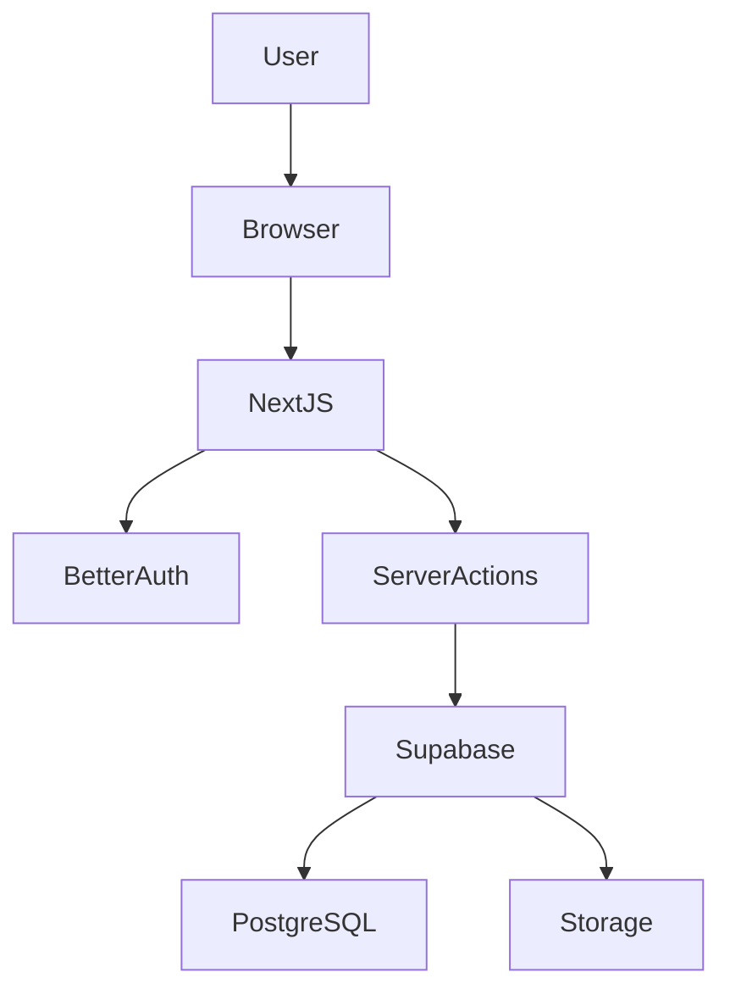
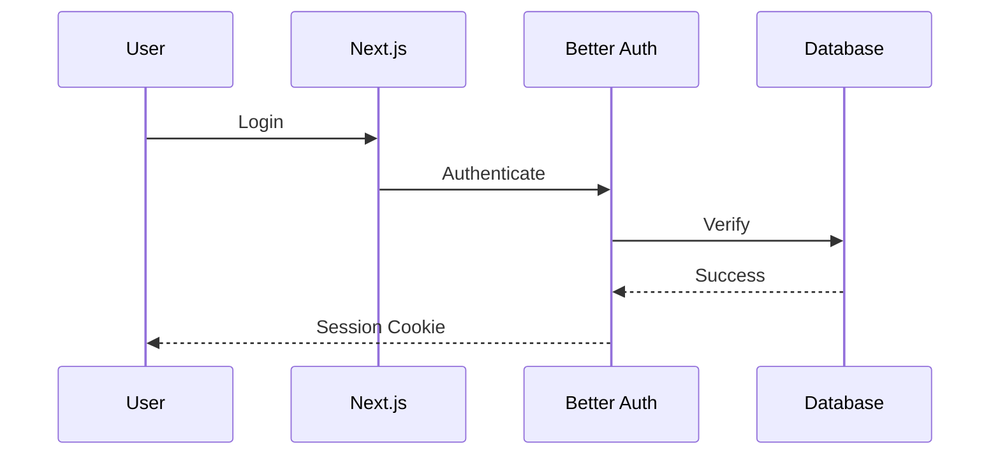
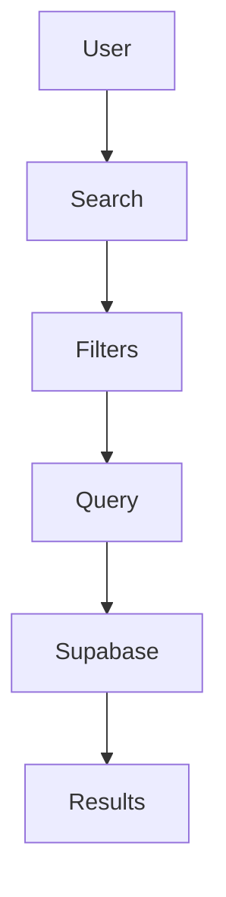

# 🚀 Business Listing SaaS

A modern, SEO-friendly Business Listing platform built with Next.js 15,
React 19, Better Auth, Drizzle ORM and Supabase.

Live Demo • Documentation • Roadmap


<p align="center">

</p>

# Features
⚡ Lightning Fast

🔒 Secure Authentication

🏢 Business Management

📍 Location Search

⭐ Reviews

📊 Analytics

🤖 AI Ready

📱 Responsive

# Tech Stack
Frontend
│
├── Next.js 15
├── React 19
├── Tailwind v4
└── Shadcn UI

Backend
│
├── Better Auth
├── Route Handlers
└── Server Actions

Database
│
├── Supabase
└── Drizzle ORM

Deployment
│
└── Vercel

# Architecture Diagram



# Project Structure
src
│
├── app
├── components
├── actions
├── db
│     ├── schema
│     ├── migrations
│     └── index.ts
├── hooks
├── lib
├── providers
└── services


# Authentication Flow



# Listing Flow

```mermaid
graph LR

User

-->

Create Listing

-->

Validation

-->

Database

-->

Business Published
```

# Search Flow 


# Folder Tree

📦 src
 ┣ 📂 app
 ┣ 📂 components
 ┣ 📂 db
 ┃ ┣ 📂 schema
 ┃ ┣ 📂 migrations
 ┃ ┗ 📜 index.ts
 ┣ 📂 actions
 ┣ 📂 hooks
 ┣ 📂 lib
 ┣ 📂 providers
 ┣ 📂 services
 ┗ 📂 types

 