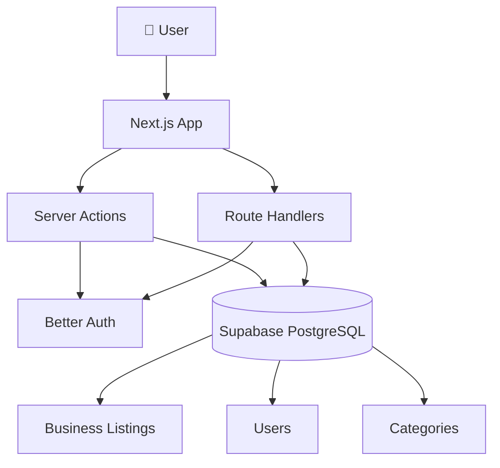
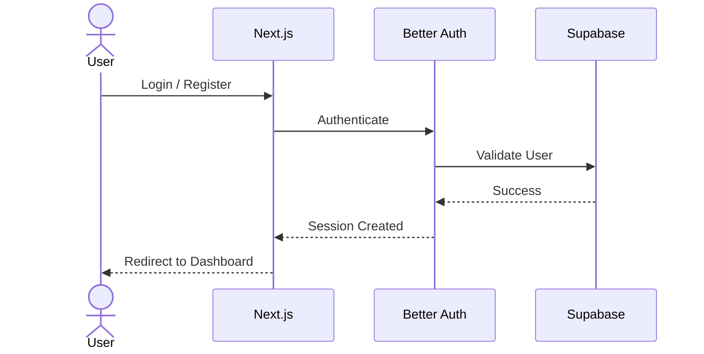
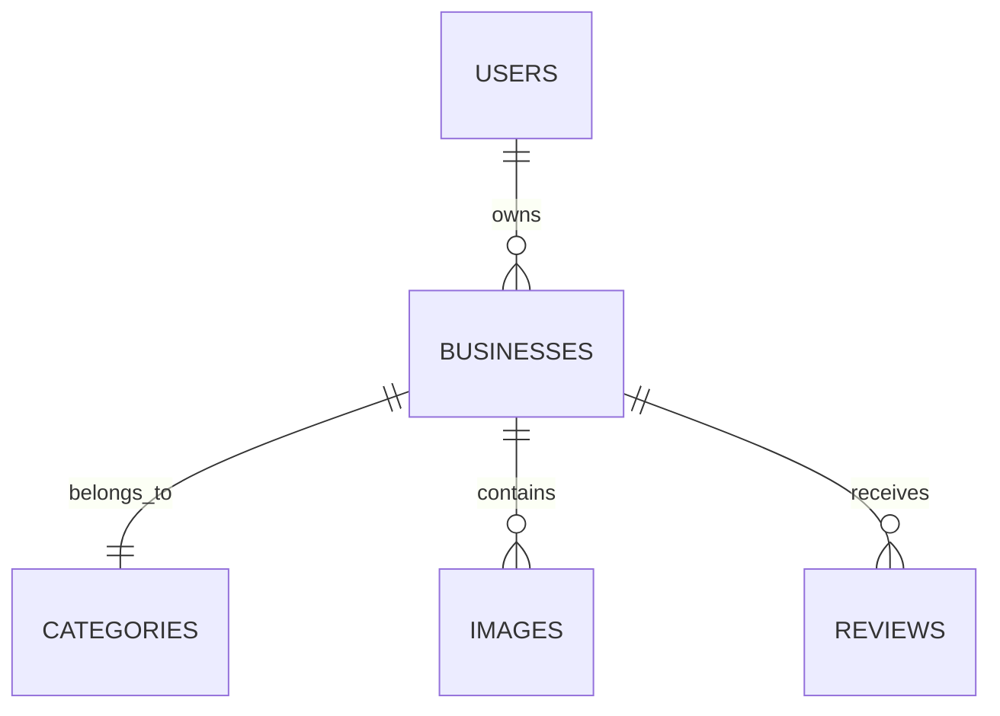
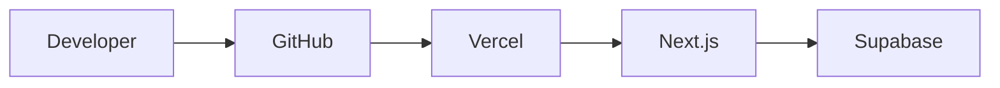

<div align="center">

# 🚀 Business Listing SaaS

*A modern, scalable and SEO-friendly Business Listing Platform built with Next.js 15, React 19, Better Auth, Drizzle ORM and Supabase.*

<br>


</div>

---

# 📖 Overview

Business Listing SaaS is a modern web application that allows businesses to create and manage listings while enabling users to discover local businesses through a fast, responsive and SEO-optimized platform.

The project focuses on clean architecture, scalability and developer experience using the latest technologies from the React ecosystem.

---

# ✨ Features

- 🔐 Secure Authentication
- 🏢 Business Listing Management
- 📂 Categories & Subcategories
- 🔍 Smart Search & Filtering
- 📍 Location-based Listings
- ⭐ Featured Businesses
- 📱 Fully Responsive UI
- 🌙 Dark / Light Theme
- ⚡ Optimized Performance
- 📈 SEO Friendly

---

# 🛠 Tech Stack

| Category | Technology |
|-----------|------------|
| Framework | Next.js 15 |
| UI | React 19 |
| Language | TypeScript |
| Styling | Tailwind CSS v4 |
| Components | shadcn/ui |
| Authentication | Better Auth |
| Database | Supabase PostgreSQL |
| ORM | Drizzle ORM |
| Icons | Lucide React |
| Deployment | Vercel |

---

# 🏗 Architecture



---

# 🔐 Authentication Flow



---

# 🗄 Database Structure



---

# 📂 Project Structure

```text
src
│
├── app                  # Next.js App Router
├── components           # Shared UI components
├── constants            # Global configurations & constants
├── db                   # Database schema & migrations
│   ├── schema           # Drizzle schema definitions
│   └── migrations       # SQL migrations
├── features             # Feature-based architecture
│   ├── business         # Business core logic
│   ├── business-onboarding # Business setup flow
│   └── dashboard        # Dashboards (Admin/Owner/Visitor)
├── hooks                # Custom React hooks
├── lib                  # Utilities & Third-party wrappers
│   ├── cloudinary       # Image optimization & uploads
│   ├── maps             # Google Maps integrations
│   ├── search           # Search algorithms & filters
│   └── supabase-storage # Document storage
├── server               # Server layer (Actions & Queries)
│   ├── actions          # Mutations (business, category, etc.)
│   └── queries          # Fetching (search, dashboard, etc.)
├── types                # Global TypeScript definitions
└── validations          # Zod validation schemas
```

---

# ⚙️ Getting Started

### Clone Repository

```bash
git clone https://github.com/your-username/business-listing-saas.git
```

```bash
cd business-listing-saas
```

### Install Dependencies

```bash
pnpm install
```

### Configure Environment

Create a `.env.local` file.

```env
DATABASE_URL=

NEXT_PUBLIC_SUPABASE_URL=
NEXT_PUBLIC_SUPABASE_ANON_KEY=
SUPABASE_SERVICE_ROLE_KEY=

BETTER_AUTH_SECRET=
BETTER_AUTH_URL=http://localhost:3000

GOOGLE_CLIENT_ID=
GOOGLE_CLIENT_SECRET=
```

### Run Development Server

```bash
pnpm dev
```

Open:

```
http://localhost:3000
```

---

# 🚀 Deployment

The project is optimized for deployment on **Vercel**.



---

# 🎯 Future Enhancements

- AI-powered Search
- Reviews & Ratings
- Maps Integration
- Business Verification
- Analytics Dashboard
- Subscription Plans
- Notifications
- Multi-language Support

---

<div align="center">

### ⭐ If you like this project, consider giving it a star.

Built with ❤️ using **Next.js**, **React**, **Supabase** and **Better Auth**.

</div>
